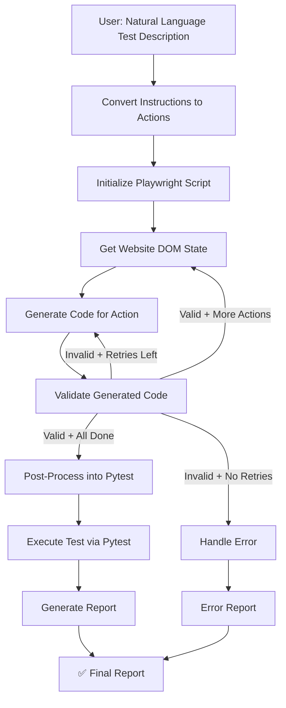

# 🧪 E2E Testing Agent

An intelligent AI agent that converts **natural language test descriptions** into executable **Playwright E2E test scripts**, runs them, and generates structured reports. Built with **LangGraph**, **Playwright**, and **Streamlit**.

> _"Test a registration form with username, password, and confirmation fields. Verify registration succeeds."_
>
> → The agent automatically writes Playwright code, executes it against your website, and delivers a pass/fail report.

---

## 🌟 Features

- **Natural Language → E2E Tests**: Describe tests in plain English — no manual scripting
- **LangGraph Agentic Pipeline**: Multi-step workflow with conditional routing and retry logic
- **Dynamic DOM Analysis**: Reads live webpage DOM to generate accurate selectors
- **Playwright Code Generation**: Produces async Playwright scripts with proper assertions
- **Automated Test Execution**: Runs tests via pytest with structured output capture
- **Structured Reports**: Markdown reports with pass/fail status, actions, and full scripts
- **Provider-Agnostic LLM**: Supports OpenAI (default), Groq, and Azure OpenAI
- **Interactive Streamlit UI**: Premium web interface with real-time progress tracking
- **Built-in Demo App**: Flask registration form included for quick testing

---

## 🏗️ Architecture



---

## 🚀 Quick Start

### Prerequisites

- Python 3.10+
- OpenAI API key
- Chromium browser (installed automatically by Playwright)

### Installation

```bash
# Navigate to the agent directory
cd "E2E testing Agent"

# Create and activate virtual environment
python -m venv venv
source venv/bin/activate  # Windows: venv\Scripts\activate

# Install dependencies
pip install -r requirements.txt

# Install Playwright browsers
playwright install chromium
```

### Configuration

```bash
# Copy the environment template
cp .env.example .env

# Edit .env and add your OpenAI API key
# OPENAI_API_KEY=sk-your-key-here
```

### Usage

#### Option 1: Streamlit UI (Recommended)

```bash
# Start the demo target app (in a separate terminal)
python demo_app.py

# Launch the Streamlit interface
streamlit run app.py
```

The app opens at `http://localhost:8501`. Configure your API key in the sidebar, then describe your test and click **Run E2E Test**.

#### Option 2: Python API

```python
from backend import E2ETestingAgent

# Initialize the agent
agent = E2ETestingAgent(
    provider="openai",
    model_name="gpt-4o-mini",
    temperature=0.0,
    api_key="sk-your-key-here",
)

# Run a test
result = agent.run_test(
    query="Test a registration form with username, password, and password confirmation. Verify registration succeeds.",
    target_url="http://localhost:5000",
)

# Print the report
print(result["report"])
```

#### Option 3: One-liner

```python
from backend import run_e2e_test

result = run_e2e_test(
    query="Test the login flow of the website.",
    target_url="http://localhost:5000",
)
print(result["report"])
```

---

## 📁 Project Structure

```
E2E testing Agent/
├── app.py                        # Streamlit web interface
├── backend.py                    # Core agent logic (LangGraph pipeline)
├── demo_app.py                   # Built-in Flask demo app for testing
├── requirements.txt              # Python dependencies
├── .env.example                  # Environment variable template
├── README.md                     # This file
└── e2e_testing_agent.ipynb       # Original notebook (reference)
```

---

## 📖 How It Works

The agent follows a **5-stage pipeline**:

| Stage | Node | Description |
|-------|------|-------------|
| **1. Parse** | `convert_user_instruction_to_actions` | LLM converts natural language into a list of atomic action steps |
| **2. Initialize** | `get_initial_action` | Creates the Playwright script skeleton with URL navigation |
| **3. Generate** | `get_website_state` → `generate_code_for_action` → `validate_generated_action` | For each action: fetches live DOM, generates Playwright code, validates syntax, inserts into script. Loops until all actions are complete. Retries up to 2× on failures. |
| **4. Execute** | `post_process_script` → `execute_test_case` | Wraps script into a pytest function, executes via subprocess |
| **5. Report** | `generate_test_report` | Produces a structured markdown report with pass/fail status |

---

## 🛠️ Configuration

### Environment Variables

| Variable | Description | Required |
|----------|-------------|----------|
| `OPENAI_API_KEY` | OpenAI API key | Yes (if using OpenAI) |
| `GROQ_API_KEY` | Groq API key | Only if using Groq |
| `AZURE_OPENAI_API_KEY` | Azure OpenAI API key | Only if using Azure |
| `AZURE_OPENAI_ENDPOINT` | Azure OpenAI endpoint URL | Only if using Azure |
| `AZURE_OPENAI_LLM_MODEL` | Azure model name | Only if using Azure |
| `AZURE_OPENAI_LLM_MODEL_DEPLOYMENT` | Azure deployment name | Only if using Azure |

### LLM Providers

| Provider | Default Model | Best For |
|----------|--------------|----------|
| `openai` | `gpt-4o-mini` | Best code generation quality (recommended) |
| `groq` | `llama-3.3-70b-versatile` | Fast inference, good for simple tests |
| `azure_openai` | `gpt-4` | Enterprise deployments |

---

## 📝 Examples

### Example 1: Registration Form

**Input:**
```
Test a registration form that contains username, password and password
confirmation fields. After submitting it, verify that registration was successful.
```

**Target URL:** `http://localhost:5000` (demo app)

**Generated Actions:**
1. Navigate to the registration page via the URL
2. Enter a valid username in the 'Username' input field
3. Enter a valid password in the 'Password' input field
4. Enter the same password in the 'Confirm Password' input field
5. Click the 'Register' button to submit the form
6. Verify that the registration was successful by checking for a success message

### Example 2: Shopping Cart

**Input:**
```
Test adding an item to the shopping cart. Navigate to the product listing,
click on the first product, add it to cart, and verify it appears in the cart.
```

---

## 🔧 Troubleshooting

| Issue | Solution |
|-------|----------|
| `playwright._impl._errors.Error: Executable doesn't exist` | Run `playwright install chromium` |
| `ModuleNotFoundError: No module named 'langchain_openai'` | Run `pip install -r requirements.txt` |
| Test times out | Increase `DEFAULT_TIMEOUT_SECONDS` in `backend.py` |
| Code generation produces invalid syntax | Try lowering temperature to 0.0 or use `gpt-4o` for better results |
| Demo app not reachable | Make sure `python demo_app.py` is running in a separate terminal |

---

## ⚠️ Security Note

This agent uses `exec()` to run LLM-generated Playwright scripts. While the code is validated for syntax and checked for Playwright commands before execution, **you should only test against websites you own or have permission to test**. Do not run untrusted test descriptions in production environments.

---

## 🤝 Contributing

Contributions are welcome! Please read the [Contributing Guidelines](../CONTRIBUTING.md) before submitting a PR.

---

## 📄 License

Apache 2.0 — See [LICENSE](../LICENSE) for details.

---

## 🙏 Acknowledgments

- [LangGraph](https://github.com/langchain-ai/langgraph) — Agentic workflow framework
- [Playwright](https://playwright.dev/python/) — Browser automation
- [LangChain](https://github.com/langchain-ai/langchain) — LLM orchestration
- [Streamlit](https://streamlit.io/) — Web interface
- [OpenAI](https://openai.com/) — Language models
